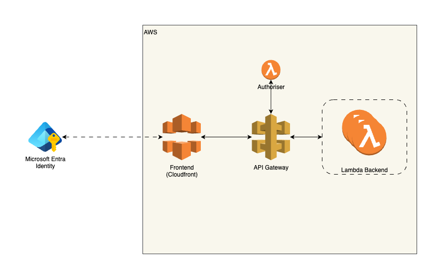

# SwivelPortal

SwivelPortal is a Microsoft Teams Tab app developed for the internal usage of SwivelGroup. This project is setup as Nx Monorepo project. please refer to Nx documentation to get familiar with it - [Nx Docs](https://nx.dev/).

## BMAD

This app is developed with the [BMAD method](https://github.com/bmad-code-org/BMAD-METHOD) and most of the code is written via `dev` agents with LLMS. Please follow this the BMAD process to keep the docs updated.

## Microsoft Entra ID setup

Swivel Portal app authenticates with Microsoft Entra ID through Microsoft Teams. To enable this SSO should be enabled. Two Microsoft Entra ID apps are already setup in the Azure portal for prod and development. Follow this [guide](https://learn.microsoft.com/en-us/microsoftteams/platform/tabs/how-to/authentication/tab-sso-overview) to configure apps in the future.

These Microsoft Entra ID apps are already registered.

- `swivel-portal-client` - for production usage
- `swivel-portal-client-dev` - for dev usage

Admin access for users in Swivel Portal is provided via Microsoft Entra ID Groups. The `swivel-portal-admin-group` group is already created and adding users to this group will make them admins. This group is added to the above Entra ID apps and their `Token Configuration` is configured to return this group in the JWT token received when authenticated. This group is read by the backend to identify users as admins.

## Development

Before starting development the project dependencies should be installed. Run the below command in the project root to install dependencies.

```sh
npm install
```

This is the overall project structure and dependency flow:


### Frontend

SwivelPortal frontend (`apps/swivel-portal`) is a React 19 application built with Vite. [Mantine](https://mantine.dev/) is used as the UI library. This app initialize and communicate with Microsoft Teams through `@microsoft/teams-js` library.

These commands are available for this app,

```sh
## build
nx build swivel-portal --configuration=<dev | production>

## dev server
nx dev swivel-portal
```

Since this is a Microsoft Teams app, the [Microsoft 365 Agents Toolkit](https://learn.microsoft.com/en-us/microsoftteams/platform/toolkit/install-agents-toolkit?tabs=vscode) extension should be installed in the IDE. The `m365agents.yml` file defines the tasks performed by this toolkit. It can `provision` and `publish` the app manifest (`teamsApp/appPackage/manifest.json`) to the [Microsoft Teams Developer Portal](https://dev.teams.microsoft.com/).

During development the VSCode debugger can be used to start the app in Microsoft Teams (click `Launch Remote in Teams (Edge)` from the debugger menu).

- Start the React app with `nx dev swivel-portal`.
- Select the `Launch Remote in Teams (Edge)` from the debugger menu in VSCode and click run.
- A new browser window will be opened with Microsoft Teams and the app installation.
- After doing changes to the React code reload the app page in Microsoft Teams to reflect the changes.

### Backend

Swivel Portal API is a AWS Lambda based backend exposed through an AWS ApiGateway. The `apps/swivel-portal-api` contains these Lambda functions. Core business logic and data access logic is abstracted into separate packages in `libs/domain` and `libs/dal`. Please refer to the `docs/architecture` for more information about the code structure.

```sh
# build
nx build swivel-portal-api --configuration=<dev | production>

```

## Environment Variables

Before running or deploying, copy `.env.sample` to `.env` in the `apps/swivel-portal/` and `infra/` and fill in the required values.

## Deployment

This project is deployed via AWS CDK. Setup AWS credentials and environment variables before running below.

### Validate CDK config

```sh
cd infra
cdk synth
```

### Deploy using scripts

You can deploy the API and frontend using the provided scripts. Each script accepts an optional environment mode argument (`dev` or `production`). Default is `dev`.

**Deploy API:**

```sh
./scripts/deploy-api.sh [dev|production]
# OR
npm run deploy-api [dev|production]
```

**Deploy Frontend:**

```sh
./scripts/deploy-frontend.sh [dev|production]
# OR
npm run deploy-frontend [dev|production]
```

These scripts will build the appropriate project and deploy using AWS CDK, passing the environment mode to both Nx and CDK.

Deployment architecture:


## Semantic Commit Message Enforcement

This repository enforces semantic commit messages using [commitlint](https://commitlint.js.org/) and [husky](https://typicode.github.io/husky/).

### What are Semantic Commits?

Semantic commit messages follow the [Conventional Commits](https://www.conventionalcommits.org/en/v1.0.0/) standard. Example formats:

- `feat: add new user login page`
- `fix: correct typo in booking logic`
- `docs: update API documentation`
- `refactor: improve seat allocation algorithm`

### How Enforcement Works

- On every commit, a git hook checks your commit message.
- If your message does not follow the conventional format, the commit will be rejected.

### How to Use

1. **Write your commit messages in the semantic format.**
   - Example: `feat: implement seat booking UI`
2. **If you see an error about your commit message,** reword it to follow the format above.

### Tooling

- **commitlint**: Lints commit messages for semantic format.
- **husky**: Manages git hooks to run commitlint automatically.

### Customization

- The commitlint rules are defined in `commitlint.config.js` in the project root.
- Husky hooks are in the `.husky/` directory.

### Troubleshooting

- If you have issues committing, check your message format first.
- For more info, see the [Conventional Commits](https://www.conventionalcommits.org/en/v1.0.0/) documentation.

---

For any questions, contact the project maintainers.
