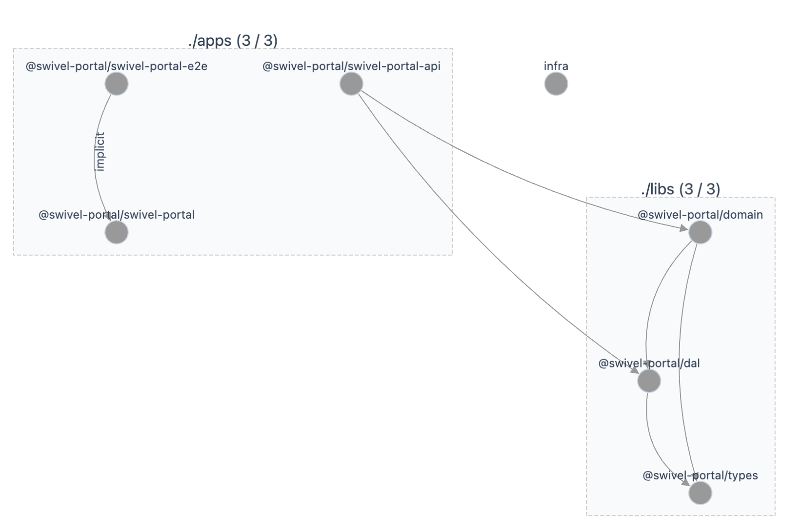

# SwivelPortal

## Run tasks

To run the dev server for your app, use:

```sh
npx nx serve swivel-portal
```

To create a production bundle:

```sh
npx nx build swivel-portal
```

To see all available targets to run for a project, run:

```sh
npx nx show project swivel-portal
```

These targets are either [inferred automatically](https://nx.dev/concepts/inferred-tasks?utm_source=nx_project&utm_medium=readme&utm_campaign=nx_projects) or defined in the `project.json` or `package.json` files.

[More about running tasks in the docs &raquo;](https://nx.dev/features/run-tasks?utm_source=nx_project&utm_medium=readme&utm_campaign=nx_projects)

## Add new projects/libs

While you could add new projects to your workspace manually, you might want to leverage [Nx plugins](https://nx.dev/concepts/nx-plugins?utm_source=nx_project&utm_medium=readme&utm_campaign=nx_projects) and their [code generation](https://nx.dev/features/generate-code?utm_source=nx_project&utm_medium=readme&utm_campaign=nx_projects) feature.

Use the plugin's generator to create new projects.

To generate a new application, use:

```sh
npx nx g @nx/react:app demo
```

To generate a new library, use:

```sh
npx nx g @nx/react:lib mylib
```

You can use `npx nx list` to get a list of installed plugins. Then, run `npx nx list <plugin-name>` to learn about more specific capabilities of a particular plugin. Alternatively, [install Nx Console](https://nx.dev/getting-started/editor-setup?utm_source=nx_project&utm_medium=readme&utm_campaign=nx_projects) to browse plugins and generators in your IDE.

[Learn more about Nx plugins &raquo;](https://nx.dev/concepts/nx-plugins?utm_source=nx_project&utm_medium=readme&utm_campaign=nx_projects) | [Browse the plugin registry &raquo;](https://nx.dev/plugin-registry?utm_source=nx_project&utm_medium=readme&utm_campaign=nx_projects)

## Development

This is the overall project structure and dependency flow:


## Deployment

This project is deployed via AWS CDK. Setup AWS credentials before running below.

- To validate CDK config

  ```
  cd infra
  cdk synth
  ```

- To deploy
  ```
  cd infra
  cdk deploy
  ```

## Semantic Commit Message Enforcement

This repository enforces semantic commit messages using [commitlint](https://commitlint.js.org/) and [husky](https://typicode.github.io/husky/).

### What are Semantic Commits?

Semantic commit messages follow the [Conventional Commits](https://www.conventionalcommits.org/en/v1.0.0/) standard. Example formats:

- `feat: add new user login page`
- `fix: correct typo in booking logic`
- `docs: update API documentation`
- `refactor: improve seat allocation algorithm`

### How Enforcement Works

- On every commit, a git hook checks your commit message.
- If your message does not follow the conventional format, the commit will be rejected.

### How to Use

1. **Write your commit messages in the semantic format.**
   - Example: `feat: implement seat booking UI`
2. **If you see an error about your commit message,** reword it to follow the format above.

### Tooling

- **commitlint**: Lints commit messages for semantic format.
- **husky**: Manages git hooks to run commitlint automatically.

### Customization

- The commitlint rules are defined in `commitlint.config.js` in the project root.
- Husky hooks are in the `.husky/` directory.

### Troubleshooting

- If you have issues committing, check your message format first.
- For more info, see the [Conventional Commits](https://www.conventionalcommits.org/en/v1.0.0/) documentation.

---

For any questions, contact the project maintainers.
