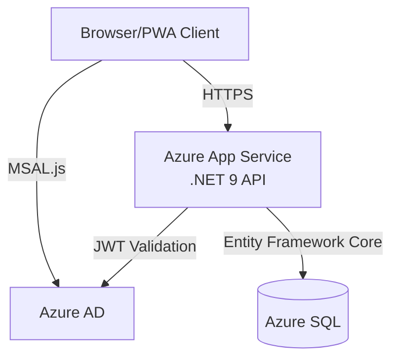
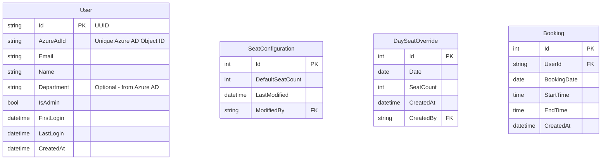
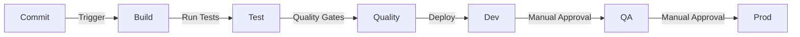

# Company Portal PWA - Technical Architecture Document

**Project**: Company Portal PWA (Seat Booking PoC)  
**Date**: 2025-10-07  
**Status**: In Progress  
**Author**: Architecture Team

## 1. System Overview

### 1.1 Architecture Overview

The Company Portal PWA is designed as a modern, secure, and scalable web application with the following high-level architecture:

- **Frontend**: React 18+ PWA with TypeScript and Vite
- **Backend**: .NET 9 Minimal API
- **Database**: Azure SQL
- **Authentication**: Azure AD (Microsoft 365)
- **Hosting**: Azure App Service
- **CI/CD**: Azure DevOps Pipelines

### 1.2 System Architecture Diagram



## 2. Technical Stack

### 2.1 Frontend Stack

- **Framework**: React 18.2.0 with TypeScript 5.2
- **Build Tool**: Vite 5.0
- **UI Framework**: ShadcnUI (React) with Tailwind CSS
- **State Management**: React Context + Hooks
- **Authentication**: MSAL.js 3.0 for Azure AD
- **HTTP Client**: Axios with interceptors
- **Testing**: Vitest + React Testing Library
- **Package Manager**: Bun (for improved performance)
- **Code Quality**:
  - ESLint with TypeScript rules
  - Prettier
  - Husky for pre-commit hooks
  - lint-staged for staged files

### 2.2 Backend Stack

- **Framework**: .NET 9 Minimal API
- **Authentication**: Microsoft.Identity.Web
- **Database Access**: Entity Framework Core 9.0
- **API Documentation**: Swagger/OpenAPI
- **Logging**: Serilog with Azure App Insights
- **Testing**: xUnit with Moq
- **Code Quality**:
  - .NET Analyzer
  - StyleCop
  - SonarQube integration

### 2.3 Database

- **Type**: Azure SQL
- **ORM**: Entity Framework Core 9.0
- **Migrations**: EF Core Code-First Migrations
- **Backup**: Azure Automated Backups

### 2.4 Infrastructure

- **Hosting**: Azure App Service (Frontend & Backend)
- **Database**: Azure SQL
- **Identity**: Azure AD
- **Monitoring**: Application Insights
- **CDN**: Azure CDN (for static assets)

## 3. Key Technical Decisions

### 3.1 Frontend Decisions

1. **React + TypeScript**:

   - Strong typing for better maintainability
   - Large ecosystem and developer familiarity
   - Excellent IDE support

2. **Vite over Create React App**:

   - Faster development server
   - Better build performance
   - Modern features out of the box

3. **ShadcnUI + Tailwind**:

   - High-quality, accessible components
   - Consistent design system
   - Easy customization
   - Small bundle size

4. **PWA Implementation**:
   - Service worker for offline capability
   - App manifest for installation
   - Cache strategies for performance

### 3.2 Backend Decisions

1. **.NET 9 Minimal API**:

   - Reduced boilerplate
   - High performance
   - Built-in OpenAPI support
   - Strong typing and IDE support

2. **Entity Framework Core**:

   - Type-safe queries
   - Migration management
   - Rich querying capabilities
   - Performance optimization features

3. **Azure AD Integration**:
   - Seamless Microsoft 365 integration
   - Enterprise-grade security
   - Token-based authentication

## 4. Security Architecture

### 4.1 Authentication Flow

1. User initiates login via Microsoft 365
2. MSAL.js handles OAuth 2.0 flow
3. Azure AD issues JWT token
4. Token stored securely in memory
5. Token included in Authorization header
6. Backend validates token with Azure AD

### 4.2 Security Measures

- HTTPS-only communication
- JWT token validation
- CORS configuration
- Content Security Policy
- Azure AD role-based access
- SQL parameters to prevent injection
- Regular security audits

## 5. Database Design

### 5.1 Entity Model



### 5.2 User Synchronization Flow

1. **Initial Authentication**:

   - User logs in via MSAL.js in frontend
   - Frontend obtains Azure AD token
   - Frontend sends token to backend `/api/auth/login`
   - Backend validates token with Azure AD

2. **User Creation/Update**:

   - Backend extracts user info from validated token:
     - Azure AD Object ID
     - Email
     - Name
     - Department (if available)
   - Backend checks if user exists by AzureAdId
   - If new user:
     - Creates User record
     - Sets FirstLogin and CreatedAt
     - Checks admin group membership via Graph API
   - If existing user:
     - Updates Name/Email if changed
     - Updates LastLogin timestamp
   - Returns user details with session token

3. **Admin Status Management**:
   - Admin status is determined by Azure AD group membership
   - Configured admin group ID in appsettings.json
   - Backend checks group membership on login
   - Updates IsAdmin flag accordingly

### 5.3 Data Access Layer

- Repository pattern implementation
- Unit of Work for transactions
- Async/await throughout
- Optimized queries with indexes
- Soft delete pattern

## 6. API Design

### 6.1 RESTful Endpoints

```typescript
// Authentication
POST / api / auth / login; // Login with Azure AD token
GET / api / auth / me; // Get current user profile

// Tools
GET / api / tools; // List available tools

// Seat Booking
GET / api / seats / availability; // Get seat availability
GET / api / seats / bookings / me; // Get user's bookings
POST / api / seats / bookings; // Create booking
DELETE / api / seats / bookings / { id }; // Cancel booking

// Admin Endpoints
GET / api / admin / seats / config; // Get seat configuration
PUT / api / admin / seats / config; // Update default seat count
PUT / api / admin / seats / override; // Set date override
```

### 6.2 API Response Format

```typescript
interface ApiResponse<T> {
  data: T;
  error?: {
    code: string;
    message: string;
    details?: any;
  };
  metadata?: {
    page?: number;
    pageSize?: number;
    total?: number;
  };
}
```

## 7. Development Workflow

### 7.1 Git Workflow

- **Main Branches**:

  - `main` - Production code
  - `develop` - Development code
  - `release/*` - Release candidates

- **Feature Branches**:

  - Format: `feature/[ticket-id]-description`
  - Example: `feature/SEAT-123-implement-booking-modal`

- **Commit Convention**:

```text
type(scope): description

[optional body]

[optional footer]
```

Types: feat, fix, docs, style, refactor, test, chore

### 7.2 Code Quality Standards

- **TypeScript**: Strict mode enabled
- **ESLint**: Airbnb preset + custom rules
- **C# Style**: .NET standard + StyleCop rules
- **Test Coverage**: Minimum 80%
- **Pull Request Requirements**:
  - No failing tests
  - Meet coverage requirements
  - Pass linting
  - Code review by 2 developers
  - No security vulnerabilities

### 7.3 Build and Deploy Pipeline



## 8. Performance Optimization

### 8.1 Frontend Optimization

- Route-based code splitting
- Image optimization
- Caching strategies
- Bundle size monitoring
- Performance budgets
- Lazy loading components

### 8.2 Backend Optimization

- Response caching
- Query optimization
- Connection pooling
- Async operations
- Resource compression

## 9. Monitoring and Logging

### 9.1 Application Insights

- Request timing
- Dependency tracking
- User flows
- Error tracking
- Custom metrics

### 9.2 Logging Strategy

- Structured logging
- Log levels properly used
- Performance impact considered
- PII data handled securely
- Log retention policy

## 10. Deployment Architecture

### 10.1 Environments

1. **Development**:

   - Feature testing
   - Integration testing
   - Automated deployments

2. **QA/Staging**:

   - UAT testing
   - Performance testing
   - Manual deployments

3. **Production**:
   - Live environment
   - Scheduled deployments
   - Rollback capability

### 10.2 Infrastructure as Code

- Azure Resource Manager templates
- Environment configuration
- Secrets management
- Backup procedures

## 11. Testing Strategy

### 11.1 Frontend Testing

- Unit tests with Vitest
- Component testing with RTL
- Integration tests
- E2E tests with Playwright
- Accessibility testing

### 11.2 Backend Testing

- Unit tests with xUnit
- Integration tests
- API tests
- Load testing
- Security testing

## 12. Documentation

### 12.0 Documentation Ownership & Implementation

#### Initial Documentation Setup (Sprint 0)

| Documentation Type | Owner              | Reviewer        | Timeline                              |
| ------------------ | ------------------ | --------------- | ------------------------------------- |
| API Documentation  | Backend Lead       | Frontend Lead   | Auto-generated during API development |
| Component Docs     | Frontend Lead      | UX Lead         | Along with component development      |
| Architecture Docs  | Solution Architect | Tech Lead       | Before development starts             |
| Setup Guides       | DevOps Engineer    | Both Leads      | Before first developer onboarding     |
| Code Style Guides  | Tech Lead          | Both Leads      | Before development starts             |
| Git Workflow       | Tech Lead          | DevOps Engineer | Before development starts             |

#### Ongoing Documentation

| Type             | Owner               | Update Trigger                    |
| ---------------- | ------------------- | --------------------------------- |
| API Changes      | API Developer       | When modifying endpoints          |
| New Components   | Component Developer | When creating/updating components |
| Setup Changes    | DevOps Engineer     | When changing infrastructure      |
| Process Changes  | Tech Lead           | When updating development process |
| Security Updates | Security Lead       | When changing security measures   |

#### Documentation Standards Enforcement

- **Pull Request Requirements**:

  - New features require documentation
  - API changes must update OpenAPI specs
  - Component changes must update component docs
  - Setup changes must update relevant guides

- **Automation**:

  - OpenAPI documentation auto-generated
  - Component props documentation enforced by ESLint
  - Dead links checking in CI pipeline
  - Documentation format validation in CI

- **Review Process**:
  - Documentation changes reviewed like code
  - Technical accuracy verified by domain expert
  - Clarity checked by someone outside the team
  - Regular documentation audits scheduled

### 12.1 Technical Documentation

#### API Documentation (OpenAPI/Swagger)

- Generated automatically from API controllers
- Includes:
  - Endpoint descriptions
  - Request/response schemas
  - Authentication requirements
  - Example requests/responses
- Available at `/swagger` in development
- Exported as static documentation for production

#### Component Documentation

- Located in `frontend/src/components/README.md`
- Each component must have:
  - Purpose and usage description
  - Props interface with JSDoc comments
  - Usage examples
  - State management details
  - Side effects documentation
- Storybook integration for visual documentation

#### Architecture Documentation

- System architecture (`docs/architecture.md`)
- Database schema (`docs/database-schema.md`)
- Infrastructure diagrams (`docs/diagrams/`)
- Security model (`docs/security.md`)
- Integration specifications (`docs/integrations/`)

#### Setup & Configuration

- Environment setup (`docs/setup/`)
  - Prerequisites installation
  - Development environment setup
  - Configuration files explanation
  - Environment variables documentation
- Production deployment (`docs/deployment/`)
  - Deployment checklist
  - Configuration management
  - SSL/TLS setup
  - Monitoring configuration

#### Troubleshooting Guides

- Common issues and solutions
- Logging and monitoring guide
- Performance optimization tips
- Debug configuration
- Support escalation process

### 12.2 Developer Documentation

#### Code Style Guides

- TypeScript/React guidelines (`docs/code-style/frontend.md`)
  - File/folder structure
  - Naming conventions
  - Component patterns
  - State management patterns
  - Error handling standards
- C# guidelines (`docs/code-style/backend.md`)
  - Project structure
  - Naming conventions
  - SOLID principles application
  - Exception handling patterns
  - Logging standards

#### Git Workflow Documentation

- Branch naming convention
- Commit message format
- Pull request process
- Code review guidelines
- Release process
- Hotfix procedures

#### Local Development

- Quick start guide
- IDE setup and extensions
- Local SSL configuration
- Mock data setup
- Docker environment (if applicable)
- Database seeding
- Test data management

#### CI/CD Pipeline

- Build pipeline documentation
- Test automation setup
- Deployment stages
- Environment promotion process
- Rollback procedures
- Emergency deployment protocol

#### Testing Standards

- Unit testing guidelines
  - Test naming convention
  - Mock/stub usage
  - Coverage requirements
  - Best practices
- Integration testing
  - Test environment setup
  - Data management
  - API testing patterns
- E2E testing
  - Test script organization
  - Test data setup
  - Browser/device coverage
- Performance testing
  - Load test scenarios
  - Benchmark requirements
  - Testing tools setup

### 12.3 Documentation Maintenance

#### Update Process

1. Documentation updates required for:

   - New features
   - API changes
   - Configuration changes
   - Process changes
   - Bug fixes affecting docs

2. Review and Approval:

   - Technical review required
   - Accuracy verification
   - Completeness check
   - Clarity assessment

3. Version Control:
   - Documentation versioning
   - Change log maintenance
   - Archive of old versions

#### Documentation Format Standards

- Markdown for all documentation
- Standard templates provided
- Consistent heading hierarchy
- Code block formatting
- Image/diagram standards
- Link management

#### Quality Assurance

- Regular documentation audits
- Broken link checking
- Accuracy verification
- User feedback collection
- Readability assessment
- SEO optimization for internal search

## 13. Future Considerations

### 13.1 Scalability

- Microservices architecture
- Container support
- Horizontal scaling
- Cache implementation
- Database sharding

### 13.2 Feature Expansion

- Meeting room booking
- Resource management
- Calendar integration
- Mobile apps
- Offline capabilities

## 14. Risk Mitigation

### 14.1 Technical Risks

1. **Authentication Integration**:

   - Early Azure AD integration
   - Fallback authentication
   - Session handling edge cases

2. **Performance**:

   - Performance monitoring
   - Load testing
   - Optimization strategy

3. **Data Integrity**:
   - Validation layers
   - Transaction management
   - Backup strategy

### 14.2 Security Risks

1. **Access Control**:

   - Role-based access
   - Token validation
   - Audit logging

2. **Data Protection**:
   - Encryption at rest
   - Secure communication
   - Regular security audits

## 15. Success Metrics

### 15.1 Technical KPIs

- Page load time < 2s
- API response time < 500ms
- Test coverage > 80%
- Zero critical security issues
- 99.9% uptime

### 15.2 Quality Metrics

- Code quality score > 85%
- < 5% technical debt
- < 24h MTTR
- Zero P1 bugs in production
