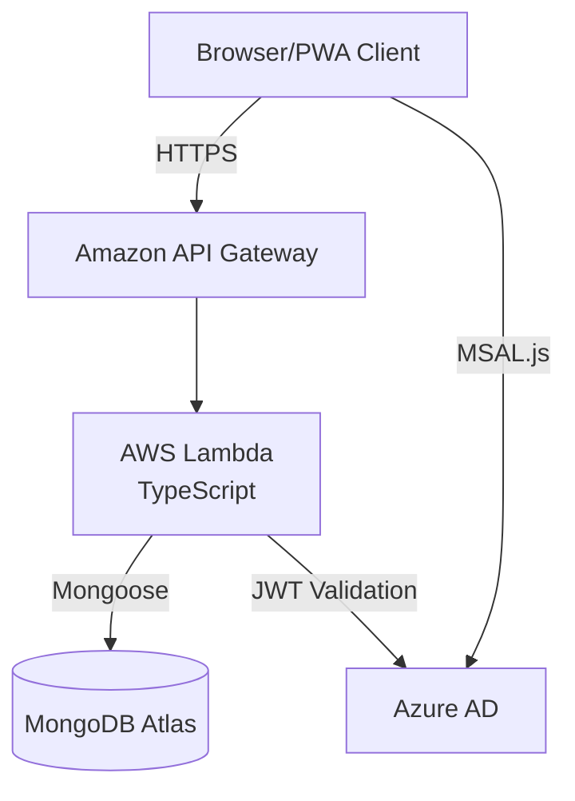

# 1. System Overview

## 1.1 Architecture Overview

The Company Portal PWA is designed as a modern, secure, and scalable web application with the following high-level architecture:

- **Frontend**: React 18+ PWA with TypeScript and Vite
- **Backend**: AWS Lambda with TypeScript
- **Database**: MongoDB Atlas
- **Authentication**: Azure AD (Microsoft 365)
- **Hosting**: AWS Lambda & API Gateway
- **CI/CD**: Azure DevOps Pipelines

## 1.2 System Architecture Diagram

