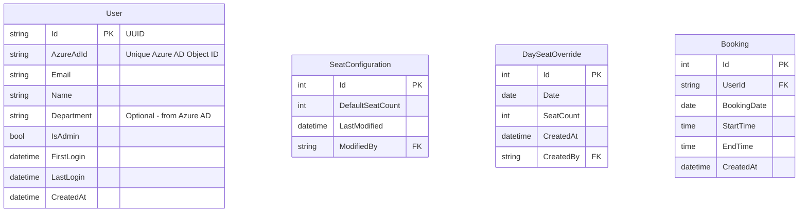

# 5. Database Design

## 5.1 Entity Model

## 5.2 User Synchronization Flow

1. **Initial Authentication**:

   - User logs in via MSAL.js in frontend
   - Frontend obtains Azure AD token
   - Frontend sends token to backend `/api/auth/login`
   - Backend validates token with Azure AD

2. **User Creation/Update**:

   - Backend extracts user info from validated token:
     - Azure AD Object ID
     - Email
     - Name
     - Department (if available)
   - Backend checks if user exists by AzureAdId
   - If new user:
     - Creates User record
     - Sets FirstLogin and CreatedAt
     - Checks admin group membership via Graph API
   - If existing user:
     - Updates Name/Email if changed
     - Updates LastLogin timestamp
   - Returns user details with session token

3. **Admin Status Management**:
   - Admin status is determined by Azure AD group membership
   - Configured admin group ID in appsettings.json
   - Backend checks group membership on login
   - Updates IsAdmin flag accordingly

## 5.3 Data Access Layer

- Repository pattern implementation
- Unit of Work for transactions
- Async/await throughout
- Optimized queries with indexes
- Soft delete pattern
