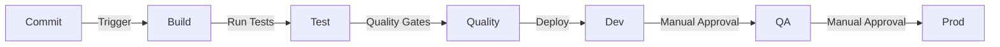

# 7. Development Workflow

## 7.1 Git Workflow

- **Main Branches**:

  - `main` - Production code
  - `develop` - Development code
  - `release/*` - Release candidates

- **Feature Branches**:

  - Format: `feature/[ticket-id]-description`
  - Example: `feature/SEAT-123-implement-booking-modal`

- **Commit Convention**:

```text
type(scope): description

[optional body]

[optional footer]
```

Types: feat, fix, docs, style, refactor, test, chore

## 7.2 Code Quality Standards

- **TypeScript**: Strict mode enabled
- **ESLint**: Airbnb preset + custom rules
- **C# Style**: .NET standard + StyleCop rules
- **Test Coverage**: Minimum 80%
- **Pull Request Requirements**:
  - No failing tests
  - Meet coverage requirements
  - Pass linting
  - Code review by 2 developers
  - No security vulnerabilities

## 7.3 Build and Deploy Pipeline


