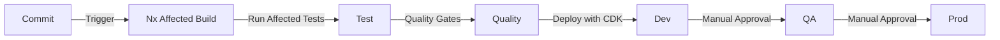

# 7. Development Workflow

## 7.1 Monorepo Structure

The project is structured as an Nx monorepo, which contains the frontend application, backend services, and shared libraries in a single repository. This approach enhances code sharing, improves dependency management, and simplifies cross-functional development.

- **`src/swivel-portal/`**: The root of the Nx workspace.
  - **`apps/`**: Contains the deployable applications.
    - `swivel-portal/`: The main React frontend application.
    - `swivel-portal-api/`: The Node.js backend with AWS Lambda functions.
  - **`libs/`**: Houses the shared libraries, promoting code reuse and separation of concerns.
    - `dal/`: The Data Access Layer, responsible for all database interactions.
    - `domain/`: Contains the core business logic and domain models.
    - `types/`: Defines shared TypeScript types and interfaces used across the monorepo.
  - **`infra/`**: Includes the AWS CDK project for defining and deploying cloud infrastructure.

## 7.2 Git Workflow

- **Main Branches**:
  - `main` - Production code
  - `develop` - Development code
  - `release/*` - Release candidates

- **Feature Branches**:
  - Format: `feature/[ticket-id]-description`
  - Example: `feature/SEAT-123-implement-booking-modal`

- **Commit Convention**:
  ```text
  type(scope): description

  [optional body]

  [optional footer]
  ```
  Types: feat, fix, docs, style, refactor, test, chore

## 7.3 Code Quality Standards

- **TypeScript**: Strict mode enabled across all libraries and applications.
- **ESLint**: Configured at the root of the monorepo to enforce consistent coding standards.
- **Test Coverage**: A minimum of 80% is required for all shared libraries and critical application logic.
- **Pull Request Requirements**:
  - No failing tests.
  - Meet coverage requirements.
  - Pass linting checks.
  - Code review by at least one other developer.
  - No security vulnerabilities.

## 7.4 Build and Deploy Pipeline

The build and deployment process is managed by Nx and the AWS CDK.


